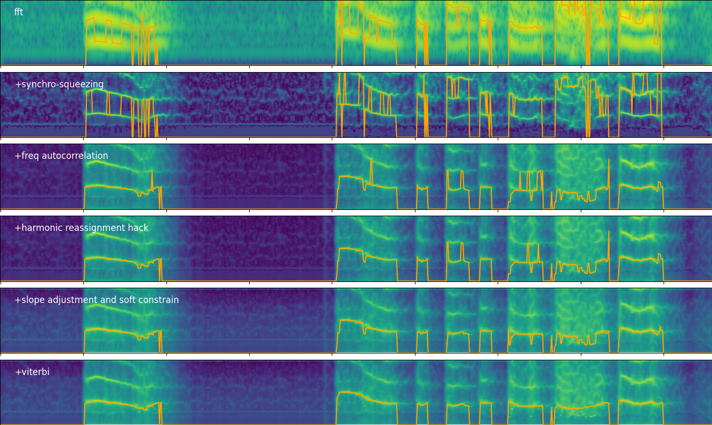
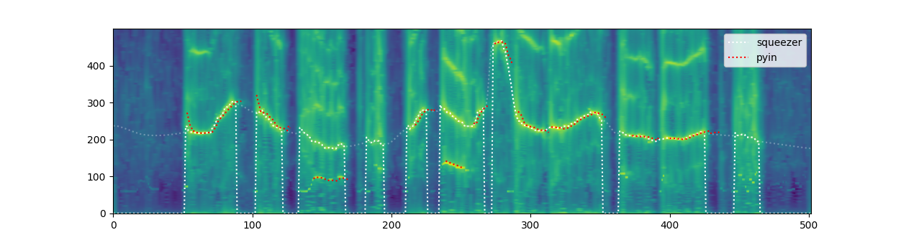

# PitchSqueezer
A pitch tracker for speech, using synchro-squeezed stft and frequency domain autocorrelation, designed to analyze imperfect recordings of spontaneous speech.
Relies heavily on the nice [ssqueezepy](https://github.com/OverLordGoldDragon/ssqueezepy/tree/master/ssqueezepy]) package.

Good:
* robust to creaky voices and bad recordings
* does not need finetuning for min and max f0, works fine with both low and high pitched voices
* acceptably fast
* provides (alternatively) a continuous pitch track, filling unvoiced gaps relatively naturally
* provides a wavelet decomposition of the pitch track (reversible, except for mean value) 
* compatible with librosa's pyin and pytorch_audio spectrograms, regarding number of frames
* a command line tool for parallel batch processing of directories (as well as API)

Not so great:
* voicing decision is simplistic
* robustness to noise is questionable
* all these assesments are impressionistic

Visualization of the method: 

Totally representative comparison with librosa.pyin on creaky female voice: 
